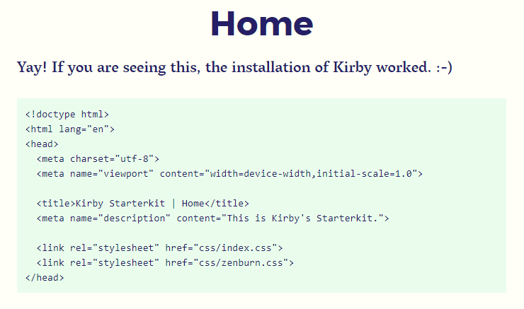

# Kirby Highlight
[](https://github.com/S1SYPHOS/kirby-highlight/releases) [](https://github.com/S1SYPHOS/kirby-highlight/blob/master/LICENSE) [](https://github.com/S1SYPHOS/kirby-highlight/issues)

This plugin highlights your code snippets server-side - without external dependencies.

- Code highlighting for everyone - no javascript needed
- Comprehensive: supports [176 languages](https://github.com/S1SYPHOS/kirby-highlight/tree/master/vendor/scrivo/highlight.php/Highlight/languages)
- Customisable: 79 different styles included



**Table of contents**
- [1. Getting started](#getting-started)
- [2. Configuration](#configuration)
- [3. Styling](#styling)
- [4. Troubleshooting](#troubleshooting)
- [5. Credits / License](#credits--license)

## Getting started
Use one of the following methods to install & use `kirby-highlight`:

### Git submodule

If you know your way around Git, you can download this plugin as a [submodule](https://github.com/blog/2104-working-with-submodules):

```text
git submodule add https://github.com/S1SYPHOS/kirby-highlight.git site/plugins/kirby-highlight
```

### Clone or download

1. [Clone](https://github.com/S1SYPHOS/kirby-highlight.git) or [download](https://github.com/S1SYPHOS/kirby-highlight/archive/master.zip)  this repository.
2. Unzip / Move the folder to `site/plugins`.

### Activate the plugin
Activate the plugin with the following line in your `config.php`:

```text
c::set('plugin.kirby-highlight', true);
``` 

Now proper classes are added to your code snippets, making  them 'themeable'. In order to do so, head over to the [styling](#styling) section. If you want to activate `kirby-highlight` only on specific domains, read about [multi-environment setups](https://getkirby.com/docs/developer-guide/configuration/options).

## Configuration
Change `kirby-highlight` options to suit your needs:

| Option | Type | Default | Description |
| --- | --- | --- | --- |
| `plugin.kirby-highlight.languages` | Array | `['html', 'php']` | Defines languages to be auto-detected (currently [141 languages](https://github.com/S1SYPHOS/kirby-highlight/tree/master/vendor/scrivo/highlight.php/Highlight/languages) are supported). |
| `plugin.kirby-highlight.escaping` | Boolean | `false` | Enables character escaping (converting `<` to `&lt;`, `>` to `&gt;`, ..), see `htmlspecialchars()` [docs](http://php.net/manual/en/function.htmlspecialchars.php). |

## Styling
Since `kirby-highlight` outputs the same markup like `highlight.js`, all styles created for the latter are suitable as well. To apply one of the many available stylesheets, just include it in your `<head>` element using the `css()` helper:

```php
<?php echo css('assets/plugins/kirby-highlight/css/zenburn.css') ?>
```

**Note: Most of the included themes depend some way or another on the class `.hljs` to be added to the code's container!**

In order to make sure the theme gets applied as planned, any of these methods will work:
- Simply use `kirby-pep` to [put it there](https://github.com/S1SYPHOS/kirby-pep): `c::set('plugin.kirby-pep.code_class', 'language-%s hljs');`
- Replace `.hljs` with `[class^="language-"]` in the included stylesheet
- Copy it to your `assets/css` directory and modify it
- Include the styles in your own workflow 

## Troubleshooting
Adding an unsupported language breaks `kirbytext()` parsing of the code snippet in question. Always be sure to only include [valid languages](https://github.com/S1SYPHOS/kirby-highlight/tree/master/vendor/scrivo/highlight.php/Highlight/languages).

## Credits / License
`kirby-highlight` is based on Geert Bergman's `highlight.php` library (a PHP port of [highlight.js](https://highlightjs.org)). It is licensed under the [MIT License](LICENSE), but **using Kirby in production** requires you to [buy a license](https://getkirby.com/buy). Are you ready for the [next step](https://getkirby.com/next)?

## Special Thanks
I'd like to thank everybody that's making great software - you people are awesome. Also I'm always thankful for feedback and bug reports :)

